# OpenClaw 系统架构图

> 版本：V1.1 | 更新：2026-05-28

---

## 一、整体架构

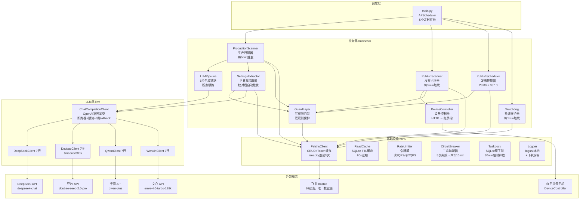

---

## 二、调度层 — 5个定时任务

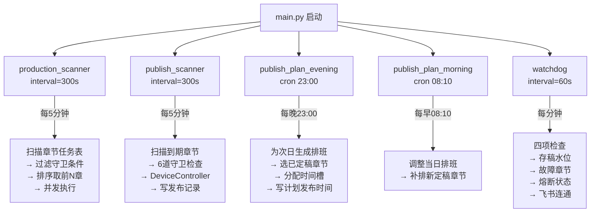

---

## 三、生产链路 — 一条章节的旅程

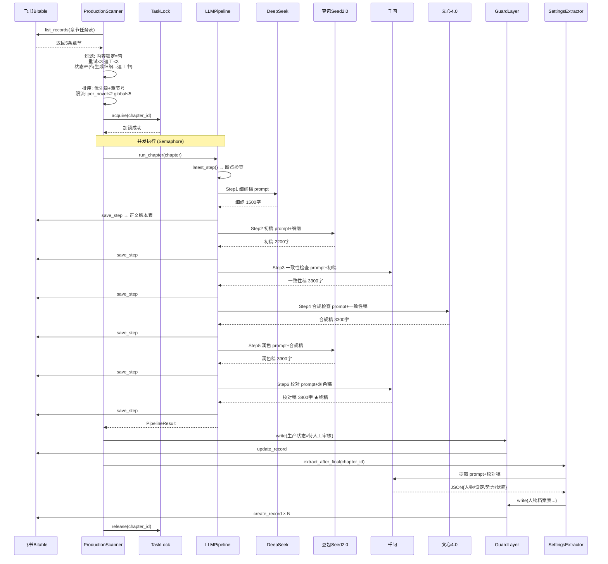

---

## 四、发布链路 — 从审核到发布

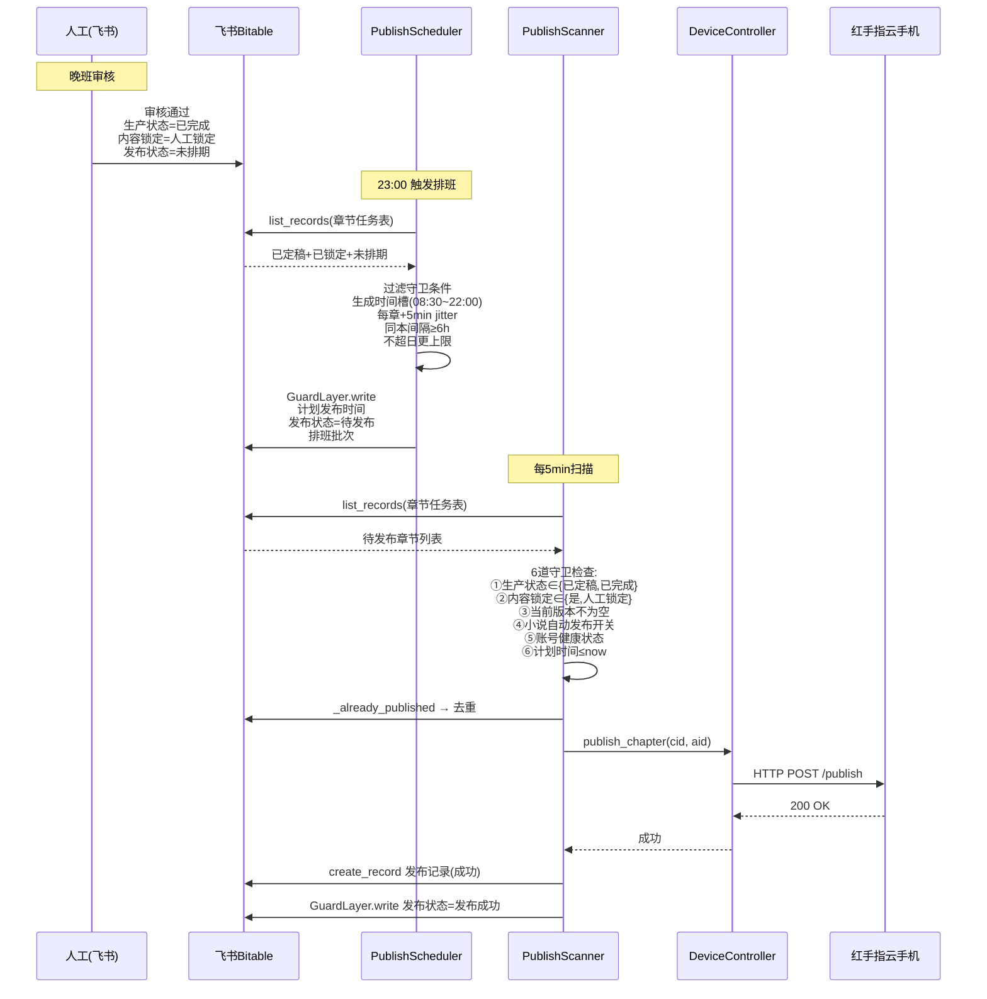

---

## 五、GuardLayer — 写保护双规则

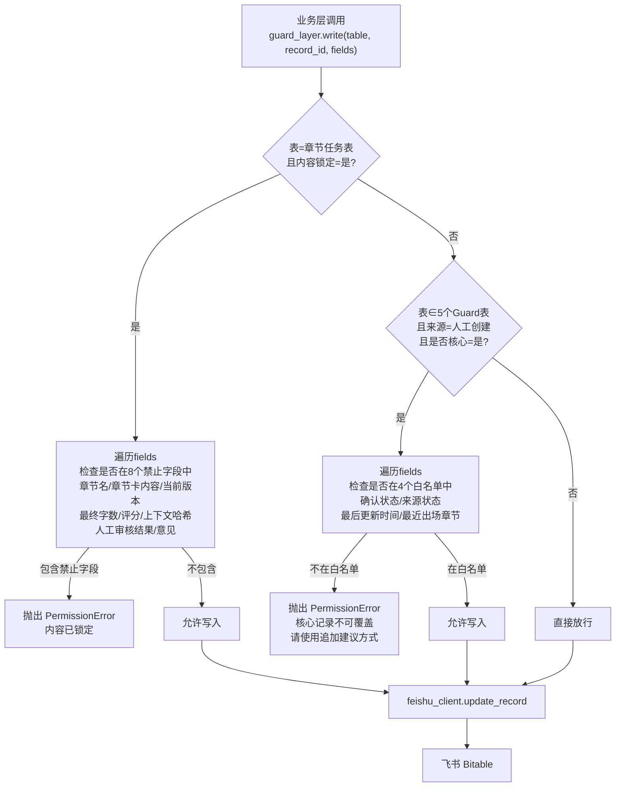

---

## 六、熔断与限流机制

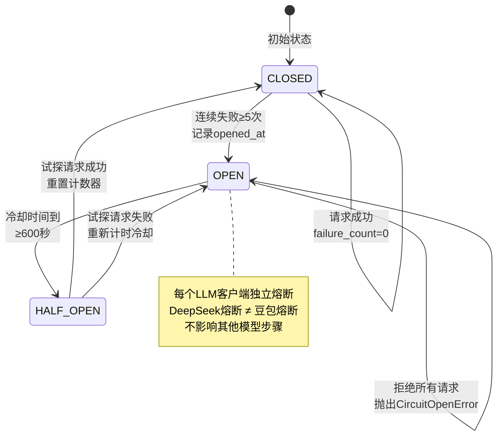

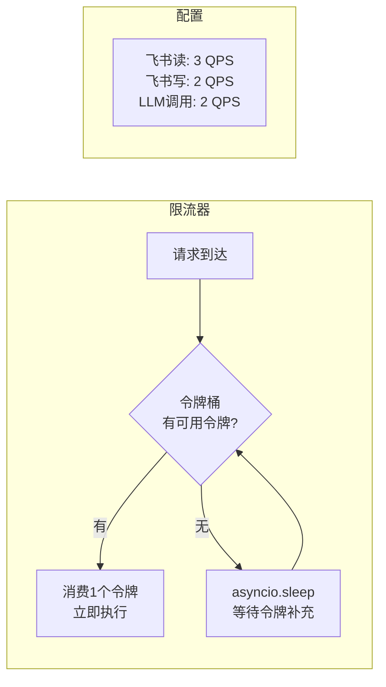

---

## 七、SettingsExtractor — 世界观提取与分级

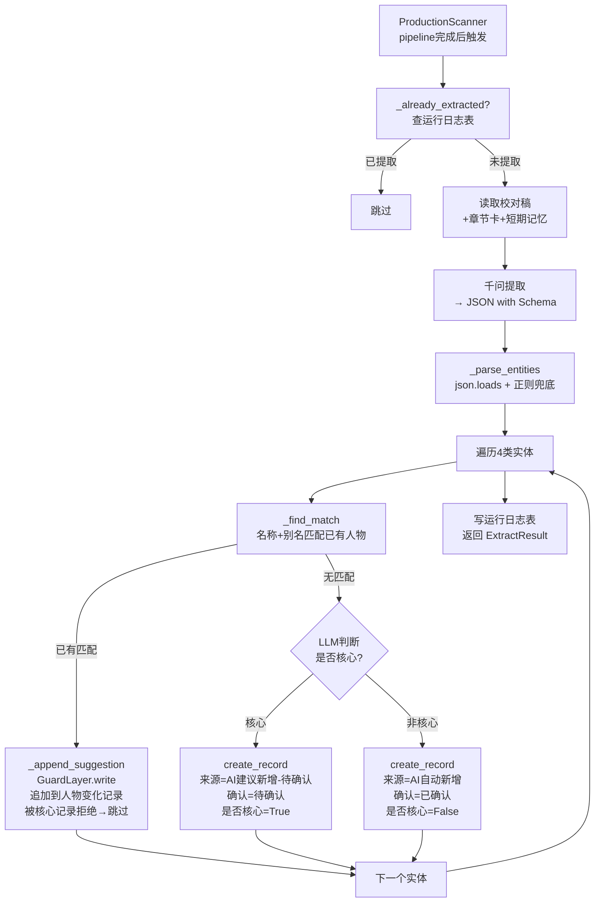

---

## 八、断点续跑机制

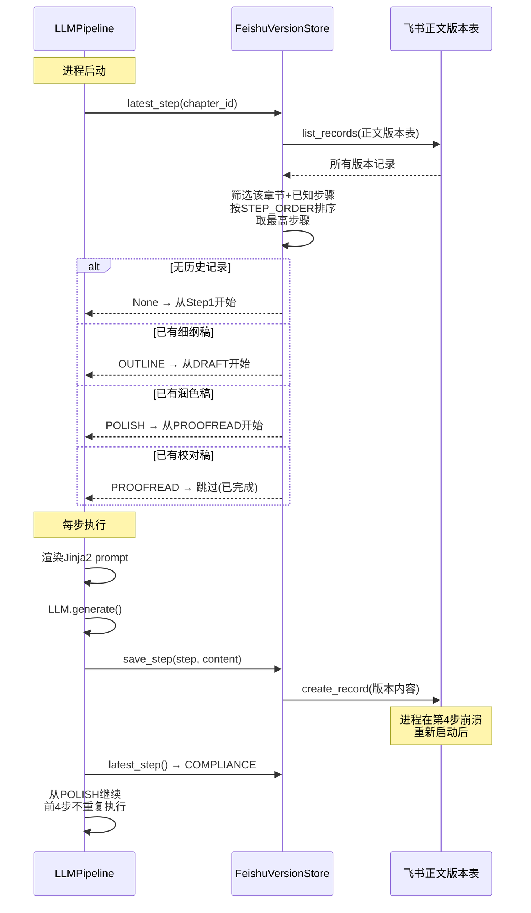

---

## 九、10本并发模型

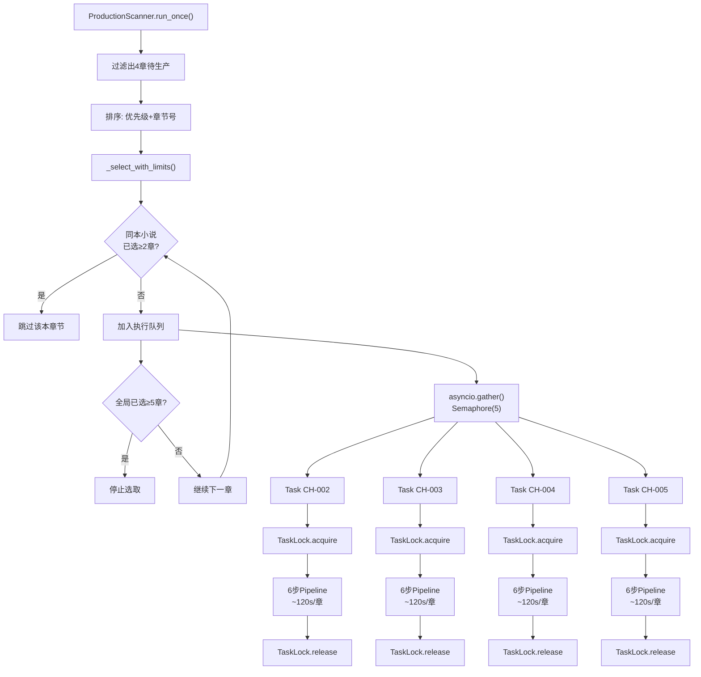

---

## 十、完整24小时时间线

```mermaid
gantt
    title OpenClaw 每日运行周期
    dateFormat HH:mm
    axisFormat %H:%M

    section 早班
    启动检查(人工)           :crit, 08:00, 30min
    早班排班(Scheduler)       :active, 08:10, 5min

    section 白天自动运行
    生产扫描(每5min)          :active, 08:30, 810min
    发布扫描(每5min)          :active, 08:30, 810min
    Watchdog监控(每1min)      :done, 08:30, 810min

    section 晚班
    晚班审核(人工)            :crit, 22:30, 75min
    晚班排班(Scheduler)       :active, 23:00, 5min
    夜间可关机               :23:05, 525min
```

---

## 十一、数据存储架构

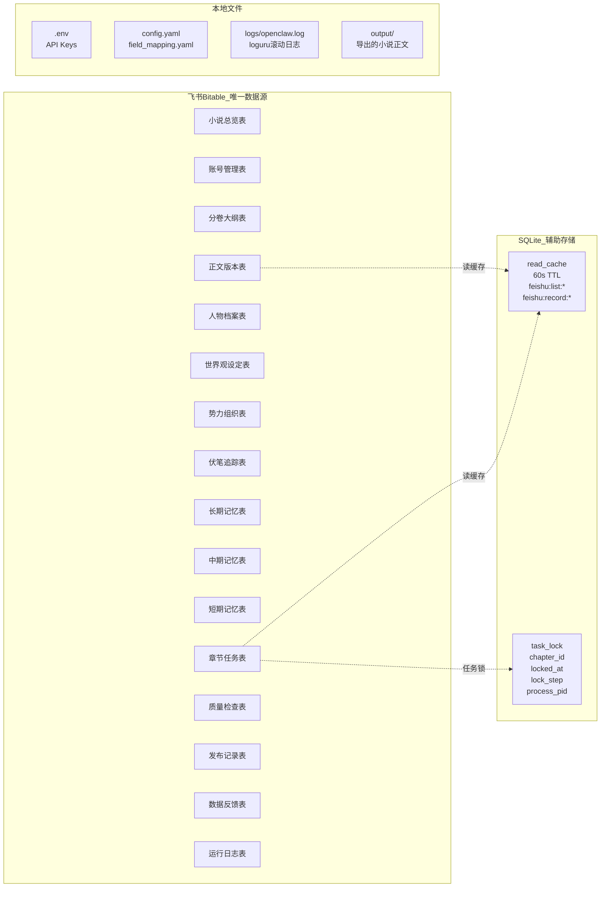

---

## 十二、错误处理层级

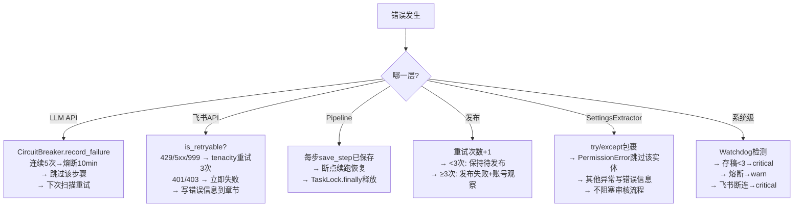

---

## 十三、代码规模

| 层 | 文件数 | Python行数 | 测试数 |
|----|--------|-----------|--------|
| core/ | 7 | ~650 | 33 |
| llm/ | 5 | ~180 | 17 |
| business/ | 8 | ~1400 | 67 |
| main.py | 1 | ~90 | 5 |
| scripts/ | 5 | ~400 | — |
| tests/ | 18 | ~2800 | — |
| prompts/ | 7 | ~200 | — |
| config/ | 3 | ~50 | — |
| **合计** | **54** | **~5,800** | **162** |
