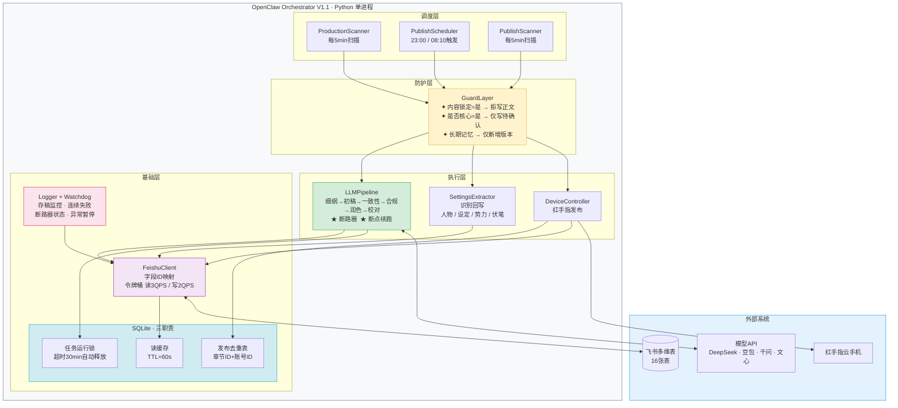
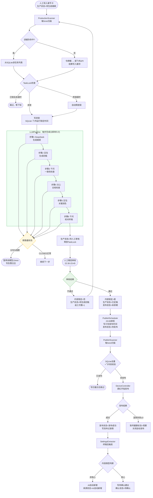
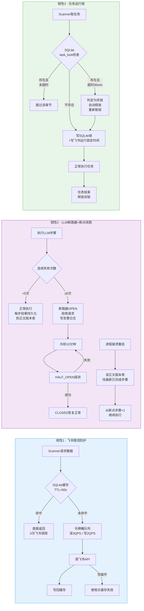

# OpenClaw（小龙虾）系统架构与开发手册 V1.1

> 基于《OpenClaw 详细标准操作流程 SOP V1.1》设计
> 设计原则：最简实现、单体优先、飞书为权威数据源、底层积木化 + 上层业务直写
> 版本：V1.1（含三层韧性补强）
> 输出日期：2026-05-20
> 适用：技术人员部署、代码开发、运维

---

## 目录

1. [设计思路与原则](#一设计思路与原则)
2. [关键假设](#二关键假设)
3. [架构总览](#三架构总览)
4. [11 个核心模块](#四11个核心模块)
5. [三层韧性机制](#五三层韧性机制)
6. [模块化哲学：积木层 vs 业务层](#六模块化哲学积木层-vs-业务层)
7. [推荐代码组织结构](#七推荐代码组织结构)
8. [运行方式与时间线](#八运行方式与时间线)
9. [关键数据流](#九关键数据流)
10. [防覆盖规则表（GuardLayer 核心）](#十防覆盖规则表guardlayer-核心)
11. [配置文件清单](#十一配置文件清单)
12. [可视化图（Mermaid）](#十二可视化图mermaid)
13. [实现红线](#十三实现红线)
14. [稳定性评估](#十四稳定性评估)
15. [开发顺序建议](#十五开发顺序建议)
16. [验收标准映射](#十六验收标准映射)

---

## 一、设计思路与原则

### 1.1 核心原则

| # | 原则 | 体现 |
|---|---|---|
| 1 | **最简实现** | 单进程单体 + SQLite + APScheduler，不上 Redis/MQ/K8s/Docker |
| 2 | **单一权威数据源** | 飞书多维表是唯一业务真相，SQLite 只做缓存/锁/去重 |
| 3 | **代码层强制规则** | 写权限、防覆盖、状态机都在 GuardLayer 强制，不依赖飞书原生权限 |
| 4 | **外科手术式扩展** | 韧性补强不引入新中间件，全部在原模块内部完成 |
| 5 | **底层积木 + 上层直写** | 通用组件接口化可复用；业务模块直写不过度抽象 |
| 6 | **可观测性内建** | 每个节点写运行日志表，本地 loguru + 飞书双写 |

### 1.2 与典型"过度工程"做法的对比

| 维度 | 典型做法 | 本架构选择 | 理由 |
|---|---|---|---|
| 部署 | K8s + 多副本 | 单进程 + systemd | 10 本规模用不上 |
| 数据 | PostgreSQL + 飞书同步 | 飞书直接读写 + SQLite 缓存 | 避免双源一致性 |
| 任务调度 | Celery + Redis | APScheduler | 单机够用 |
| 限流 | Sentinel/Nginx | pyrate_limiter | 进程内令牌桶 |
| 日志 | ELK | loguru + 飞书表 | 业务可见性优先 |
| 监控 | Prometheus + Grafana | Watchdog + 飞书告警 | 维护成本低 |

---

## 二、关键假设

1. 飞书多维表（16 表）是**唯一权威数据源**，本地 SQLite 承担读缓存、去重、任务锁三个职责。
2. 部署形态采用**单进程单体**（Python 服务），不引入消息队列、微服务、K8s。
3. 红手指云手机通过其官方 API / ADB 触发发布动作，不做"拟人化伪装"（与文档边界一致）。
4. 模型链：DeepSeek → 豆包 → 千问 → 文心 → 豆包 → 千问，固定串行；单本最多 2 章并发，全局最多 5 章并发。
5. 字段写权限与防覆盖**在代码层强制**（白名单 + 锁定校验），不依赖飞书原生权限。
6. 排班用单机定时器（APScheduler），不上分布式调度。

---

## 三、架构总览

```
┌─────────────────────────────────────────────────────────────┐
│                 OpenClaw Orchestrator V1.1                  │
│                  (Python 单进程服务)                         │
│                                                              │
│  ┌─────────────┐   ┌─────────────┐   ┌─────────────┐       │
│  │ Production  │   │ Publish     │   │ Publish     │       │
│  │ Scanner     │   │ Scheduler   │   │ Scanner     │       │
│  │ (5min cron) │   │ (23:00/8:10)│   │ (5min cron) │       │
│  └──────┬──────┘   └──────┬──────┘   └──────┬──────┘       │
│         │                 │                  │               │
│         ▼                 ▼                  ▼               │
│  ┌─────────────────────────────────────────────────┐        │
│  │   Guard Layer（写权限白名单 + 防覆盖校验）       │        │
│  │   - 内容锁定=是 → 拒写正文/章节卡               │        │
│  │   - 是否核心=是 → 仅可写"待确认"建议             │        │
│  │   - 长期记忆 → 仅可新增版本                     │        │
│  └─────────────────────────────────────────────────┘        │
│         │                 │                  │               │
│  ┌──────▼──────┐   ┌──────▼──────┐   ┌──────▼──────┐       │
│  │ LLM Pipeline│   │ Settings    │   │ Device      │       │
│  │ + 断路器    │   │ Extractor   │   │ Controller  │       │
│  │ + 断点续跑  │   │ (识别回写)  │   │ (红手指)    │       │
│  └─────────────┘   └─────────────┘   └─────────────┘       │
│         │                 │                  │               │
│  ┌──────▼─────────────────▼──────────────────▼──────┐       │
│  │              Feishu Bitable Client                │       │
│  │   字段ID映射 + 令牌桶限速(3QPS读/2QPS写) + 重试    │       │
│  └──────────────────────┬────────────────────────────┘       │
│                         │                                     │
│  ┌──────────────────────▼────────────────────────────┐       │
│  │                Local State: SQLite                │       │
│  │  ┌──────────────┐ ┌──────────────┐ ┌───────────┐ │       │
│  │  │ 读缓存层     │ │ 任务运行锁   │ │ 发布去重  │ │       │
│  │  │ TTL=60s      │ │ 锁+超时30min │ │ 章节+账号 │ │       │
│  │  └──────────────┘ └──────────────┘ └───────────┘ │       │
│  └───────────────────────────────────────────────────┘       │
└─────────────────────────────────────────────────────────────┘
        ▲                                    ▲
        │                                    │
   飞书多维表(16表)                   模型API + 红手指
   (权威数据源)              (DeepSeek / 豆包 / 千问 / 文心)
```

### 层级划分（自上而下）

| 层 | 模块 | 职责 |
|---|---|---|
| 调度层 | Scanner × 2 + Scheduler | 触发任务，单纯的时间驱动 |
| 防护层 | GuardLayer | 所有写飞书的强制门神 |
| 执行层 | LLMPipeline / SettingsExtractor / DeviceController | 干活的业务逻辑 |
| 基础层 | FeishuClient / SQLite / Logger+Watchdog | 通用积木 |

---

## 四、11 个核心模块

| # | 模块 | 职责 | 对应 SOP / 新增 |
|---|---|---|---|
| 1 | `config.yaml` | 表ID/字段ID映射、模型Key、设备ID、扫描间隔、并发、存稿安全线、排班窗口、令牌桶参数 | §11 |
| 2 | `FeishuClient` | 16 表 CRUD，封装字段ID，内置令牌桶限速 | §11 |
| 3 | `ReadCache` | SQLite 读缓存，TTL=60s，写入时自动失效 | **V1.1新增** |
| 4 | `GuardLayer` | 字段级白名单 + 锁定/核心/长期记忆三类防覆盖规则 | §4 |
| 5 | `LLMPipeline` | 6 步串行 + 各模型断路器 + 断点续跑（步骤持久化） | §6 + **V1.1强化** |
| 6 | `TaskLock` | SQLite task_lock + 飞书运行锁定时间字段双锁，防重复生产 | **V1.1新增** |
| 7 | `ProductionScanner` | 5min 扫描，先检 TaskLock，按优先级取任务，推进到"待人工审核"停 | §6 |
| 8 | `PublishScheduler` | 晚 23:00 + 早 08:10 触发，生成计划发布时间 | §7.2 |
| 9 | `PublishScanner` | 5min 扫描，SQLite 去重，调红手指，写发布记录 | §7.1 |
| 10 | `SettingsExtractor` | 终稿后触发，识别回写人物/设定/势力/伏笔 | §8 |
| 11 | `Logger + Watchdog` | 每节点写运行日志表；监控存稿/连续失败/API超时/断路器状态 | §10 |

---

## 五、三层韧性机制

### 5.1 飞书读缓存 + 令牌桶（解决限流风险）

```
读请求路径：
  Scanner 请求数据
    → 先查 SQLite 读缓存（TTL 60s）
    → 命中 → 直接返回，不调飞书
    → 未命中 → 进令牌桶队列（3 QPS 上限）
              → 调飞书 API
              → 写回 SQLite 缓存

写请求路径：
  GuardLayer.write()
    → 令牌桶（2 QPS 上限）
    → 调飞书 API
    → 成功后同步使 SQLite 该记录缓存失效
```

**令牌桶参数：**
- 飞书读：3 QPS，桶容量 10
- 飞书写：2 QPS，桶容量 5
- LLM 调用：各模型独立令牌桶，初始 2 QPS

### 5.2 LLM 断路器 + 断点续跑

**断路器状态机（每个模型独立）：**

```
CLOSED → OPEN → HALF_OPEN → CLOSED

CLOSED（正常）:
  连续失败 5 次 → OPEN，写告警日志

OPEN（熔断）:
  冷却 10 分钟，拒绝所有该模型请求
  10 分钟后 → HALF_OPEN

HALF_OPEN（探测）:
  放行 1 次请求
  成功 → CLOSED
  失败 → OPEN（再等 10 分钟）
```

**断点续跑：** 每完成一步立即写入飞书正文版本表

```
版本类型字段值：
  细纲稿   → 步骤1完成
  初稿     → 步骤2完成
  一致性稿 → 步骤3完成
  合规稿   → 步骤4完成
  润色稿   → 步骤5完成
  校对稿   → 步骤6完成（=终稿）

Scanner 重新捡起任务时：
  → 读正文版本表，找最新已完成版本
  → 从该版本对应的下一步骤继续
```

### 5.3 任务运行锁

**SQLite 表结构：**

```sql
CREATE TABLE task_lock (
    chapter_id   TEXT PRIMARY KEY,
    locked_at    TIMESTAMP,
    lock_step    TEXT,
    process_pid  INTEGER
);
```

**飞书侧同步：** 章节任务表新增 `运行锁定时间` 字段

**加锁/释放逻辑：**

```
Scanner 取任务前：
  1. 查 SQLite task_lock，若 locked_at < now-30min → 死锁，自动释放
  2. 若不存在 → 写双锁
  3. 锁存在且未超时 → 跳过

任务完成/失败后：
  → 删除 SQLite 锁
  → 清空飞书 运行锁定时间
```

---

## 六、模块化哲学：积木层 vs 业务层

### 6.1 设计判断

当前架构遵循 **"底层积木化 + 上层业务直写"** 的折中策略，**不追求完全积木式**。理由：YAGNI 原则——目前只跑"10 本小说自动化"一个业务，做完整接口抽象会增加 50%~80% 工作量却用不上。

### 6.2 双层划分

```
积木层（接口抽象，可独立复用到其它项目）
  ├─ FeishuClient       任何用飞书的项目可直接复用
  ├─ ReadCache          任何需要本地缓存的项目可复用
  ├─ TaskLock           任何防重复任务场景可复用
  ├─ RateLimiter        任何外部API限速场景可复用
  ├─ CircuitBreaker     任何不稳定外部服务都可复用
  └─ Logger             任何项目可复用

业务层（直写小说生产逻辑，不抽象）
  ├─ GuardLayer         规则直接写在代码里
  ├─ LLMPipeline        6 步硬编码
  ├─ SettingsExtractor  人物/势力/伏笔概念硬编码
  └─ Scanner / Scheduler 状态机硬编码
```

### 6.3 何时升级到完全积木式

当出现以下信号时才考虑升级：
- 需要把系统改造去做短视频脚本/电商详情页/公众号文章自动化
- 出现 ≥2 个相似业务需要共享 70% 以上的代码
- 团队明确未来要做"低代码 AI 内容生产平台"

否则保持当前形态，避免为"假想需求"付出复杂度成本。

---

## 七、推荐代码组织结构

```
openclaw/
├── main.py                          # 入口，启动 APScheduler 和事件循环
├── config/
│   ├── config.yaml                  # 业务可调参数
│   ├── field_mapping.yaml           # 飞书 16 表 × 字段ID 映射
│   └── .env                         # API Key（不入库）
├── core/                            # 积木层（可独立复用）
│   ├── __init__.py
│   ├── feishu_client.py             # 飞书 SDK 封装
│   ├── read_cache.py                # SQLite TTL 缓存
│   ├── task_lock.py                 # 双锁机制
│   ├── rate_limiter.py              # 令牌桶
│   ├── circuit_breaker.py           # 断路器
│   └── logger.py                    # loguru + 飞书双写
├── business/                        # 业务层（直写）
│   ├── __init__.py
│   ├── guard_layer.py               # 写权限 + 防覆盖
│   ├── llm_pipeline.py              # 6 步 LLM 链路
│   ├── settings_extractor.py        # 设定识别回写
│   ├── device_controller.py         # 红手指控制
│   ├── production_scanner.py
│   ├── publish_scheduler.py
│   ├── publish_scanner.py
│   └── watchdog.py
├── llm/                             # LLM 适配层（每个模型一个文件）
│   ├── __init__.py
│   ├── base.py                      # LLMClient 抽象基类
│   ├── deepseek.py
│   ├── doubao.py
│   ├── qwen.py
│   └── wenxin.py
├── prompts/                         # Prompt 模板（外置，方便迭代）
│   ├── outline.j2
│   ├── draft.j2
│   ├── consistency.j2
│   ├── compliance.j2
│   ├── polish.j2
│   └── proofread.j2
├── data/
│   └── openclaw.sqlite              # 本地 SQLite 文件
├── logs/
│   └── openclaw.log                 # loguru 滚动日志
├── tests/
│   ├── test_guard_layer.py          # 重点测：防覆盖规则
│   ├── test_task_lock.py            # 重点测：死锁释放
│   ├── test_circuit_breaker.py
│   └── test_rate_limiter.py
├── scripts/
│   ├── bootstrap_feishu.py          # 16 表初始化导入
│   └── healthcheck.py               # 部署后健康检查
├── requirements.txt
└── README.md
```

### 关键约束

- `business/` 模块**只能依赖 `core/`**，不能反向依赖
- `core/` 模块**不能依赖 `business/`**，确保积木层独立可复用
- 所有 LLM 都通过 `llm/base.py` 抽象，方便替换模型

---

## 八、运行方式与时间线

### 8.1 部署形态

```
单台服务器（Windows / Linux 均可）
  ├─ OpenClaw 主进程（Python，systemd / 任务计划自启）
  │   ├─ APScheduler 后台线程（管所有定时任务）
  │   ├─ asyncio 事件循环（管 LLM/飞书/红手指并发IO）
  │   └─ SQLite 文件（同机，零网络依赖）
  └─ 红手指客户端（与主进程同机或同内网）
       └─ 控制 10 台云手机
```

### 8.2 典型 24 小时时间线

```
时间        触发者              动作
─────────────────────────────────────────────────────────────
08:00      人工               打开电脑、确认红手指/飞书/模型API 连通
08:10      PublishScheduler   补生成当日剩余排班
08:30      PublishScanner     首批发布
08:30+
 每5min    ProductionScanner  扫待生产章节 → LLMPipeline 6步链路
 每5min    PublishScanner     扫待发布章节 → 红手指发布
 每章终稿后 SettingsExtractor  识别新人物/设定/势力/伏笔
 每节点    Logger             写飞书运行日志表
 持续      Watchdog           监控存稿、连续失败、断路器

22:00      PublishScanner     发布窗口截止
22:30      人工               晚班审核开始
23:00      PublishScheduler   预生成次日 20 章排班
23:45      人工               确认存稿和排班 → 关机或保持
```

### 8.3 并发模型

```
APScheduler 主循环（单线程）
   │
   ├─ 触发 ProductionScanner
   │     └─ asyncio.gather() 并发跑 ≤5 章
   │           ├─ 章A: 6步串行（每步 await LLM）
   │           ├─ 章B: 6步串行
   │           └─ ...
   │
   ├─ 触发 PublishScanner
   │     └─ 同步取锁 → 串行发布 1 章（红手指不并发）
   │
   └─ 触发 Watchdog
         └─ 同步检查 SQLite + 飞书状态
```

### 8.4 扫描节奏

| 任务 | 节奏 | 触发器 | 单次耗时 |
|---|---|---|---|
| ProductionScanner | 每 5 分钟 | interval | ~30秒 |
| PublishScanner | 每 5 分钟 | interval | ~10秒 |
| PublishScheduler | 23:00 + 08:10 | cron | ~20秒 |
| Watchdog | 每 1 分钟 | interval | ~5秒 |
| 读缓存清理 | 每 10 分钟 | interval | ~1秒 |

---

## 九、关键数据流

```
[人工导入章节卡]
  生产状态=待生成细纲
        │
        ▼
[ProductionScanner 每5min]
  → 查 ReadCache（TTL 60s）获取任务列表
  → TaskLock 检查：已锁且未超时 → 跳过
  → 未锁 → 写双锁（SQLite + 飞书运行锁定时间）
        │
        ▼
[LLMPipeline 6步，每步完成立即持久化]
  细纲 → 初稿 → 一致性 → 合规 → 润色 → 校对
  ↑ 任一步骤断路器 OPEN → 暂停该模型10分钟
  ↑ 进程崩溃重启 → 读最新版本类型，从断点续跑
        │
        ▼
  生产状态=待人工审核 → 释放 TaskLock
        │
        ▼
[人工晚班审核 22:30-23:45]
        │
        ▼
  审核通过 → 内容锁定=是, 生产状态=已定稿, 发布状态=未排期
        │
        ▼
[PublishScheduler 23:00 排班]
  写入 计划发布时间 / 排班批次, 发布状态=待发布
        │
        ▼
[PublishScanner 每5min]
  → SQLite 去重 + 飞书发布记录双校验
  → DeviceController(红手指) 发布
  → 写发布记录表
        │
        ▼
  发布状态=发布成功
        │
        ▼
[SettingsExtractor 终稿后触发]
  非核心 → AI自动新增（来源状态=AI自动新增）
  核心   → 仅写待确认建议（确认状态=待确认）
```

---

## 十、防覆盖规则表（GuardLayer 核心）

| 对象 | 禁止写 | 允许写 |
|---|---|---|
| 内容锁定状态=是 的章节 | 章节名、章节卡核心、当前版本对应正文、人工审核意见 | 发布记录、数据反馈、运行日志、短期记忆、发布状态 |
| 人工创建 + 是否核心=是 的人物/设定/势力/伏笔 | 直接覆盖原内容 | 新建"AI建议新增-待确认"记录或备注 |
| 长期记忆旧版本 | 覆盖原文本 | 仅新建版本并切换"是否当前生效" |
| 已发布章节 | 修改已发布正文版本 | 追加数据反馈、运行日志 |
| 当前最终版正文 | 直接覆盖 | 新建更高版本，标记为最终版 |

**实现要点：**
- GuardLayer 是**唯一**写飞书的入口
- 提供 `Guard.write(table, record_id, fields)` 统一签名
- 所有规则用配置表驱动，方便调整

---

## 十一、配置文件清单

### 11.1 config.yaml

```yaml
scan:
  production_interval_seconds: 300       # 生产扫描间隔
  publish_interval_seconds: 300          # 发布扫描间隔

concurrency:
  per_novel_max: 2                       # 单本同时处理章数
  global_max: 5                          # 全局并发上限

retry:
  llm_max_attempts: 3                    # LLM 失败重试
  publish_max_attempts: 3                # 发布失败重试

circuit_breaker:
  failure_threshold: 5                   # 触发断路的连续失败次数
  cooldown_seconds: 600                  # 熔断冷却时间

rate_limit:
  feishu_read_qps: 3
  feishu_write_qps: 2
  feishu_bucket_capacity: 10

cache:
  read_cache_ttl_seconds: 60

task_lock:
  lock_timeout_minutes: 30               # 超时视为死锁

inventory:
  safety_threshold: 6                    # 存稿安全线
  warning_threshold: 4                   # 存稿预警线
  pause_threshold: 3                     # 暂停发布阈值

publish_window:
  earliest: "08:30"
  latest:   "22:00"
  min_gap_hours: 6                       # 同本两章最小间隔
  jitter_minutes: [5, 15]                # 冲突顺延范围

confirm_queue:
  alert_threshold: 20                    # 待确认堆积报警
```

### 11.2 field_mapping.yaml（示例）

```yaml
小说总览表:
  table_id: tblXXXX001
  fields:
    小说ID:            fldXXXX001
    书名:              fldXXXX002
    自动流程开关:      fldXXXX003
    自动发布开关:      fldXXXX004
    最低存稿章节数:    fldXXXX005

章节任务表:
  table_id: tblXXXX002
  fields:
    章节ID:            fldYYYY001
    生产状态:          fldYYYY002
    发布状态:          fldYYYY003
    内容锁定状态:      fldYYYY004
    运行锁定时间:      fldYYYY005   # V1.1 新增
    # ...
# ...其它14张表
```

### 11.3 .env

```
FEISHU_APP_ID=xxx
FEISHU_APP_SECRET=xxx
DEEPSEEK_API_KEY=xxx
DOUBAO_API_KEY=xxx
QWEN_API_KEY=xxx
WENXIN_API_KEY=xxx
HONGSHOUZHI_ENDPOINT=http://192.168.x.x:port
```

---

## 十二、可视化图（Mermaid）

### 12.1 架构总览



### 12.2 章节完整数据流



### 12.3 三层韧性机制



---

## 十三、实现红线

1. **所有写入必经 GuardLayer**
   禁止任何模块直接调用 `FeishuClient.update`，必须走 `Guard.write(table, record_id, fields)`，由它判断锁定 / 核心 / 版本规则。

2. **字段 ID 映射单独维护**（`field_mapping.yaml`）
   代码里只引用语义名，避免飞书改名导致全线崩。

3. **发布去重本地 SQLite + 飞书发布记录表双重校验**
   先查本地再查飞书，避免重复发布。

4. **业务层只能依赖积木层，不能反向依赖**
   保证 `core/` 可独立拆走复用。

5. **所有 LLM 步骤完成即持久化**
   决不在内存中累积多步结果，避免崩溃丢失。

6. **所有外部 API 调用必经令牌桶 + 断路器**
   飞书、模型 API、红手指都不例外。

---

## 十四、稳定性评估

| 维度 | V1.0 | V1.1 | 提升点 |
|---|---|---|---|
| 飞书限流抗性 | 6/10 | 9/10 | 读缓存 + 令牌桶消除大部分限流风险 |
| LLM 链路稳定性 | 6/10 | 8/10 | 断路器防雪崩，断点续跑减少浪费 |
| 崩溃恢复能力 | 6/10 | 9/10 | 双锁 + 步骤持久化，重启后无缝续跑 |
| 发布链路稳定性 | 8/10 | 8/10 | 原本已足够 |
| 架构设计合理性 | 9/10 | 9/10 | 保持最简，未引入额外中间件 |
| **综合** | **7/10** | **8.5/10** | 预计故障从每周半天降至每月以下 |

### 产能可达性验算

```
目标：10本 × 每天25章 = 250章/天
全局并发：5章
可用窗口：08:30-23:00 = 14.5小时 = 870分钟
单章最大允许时间：870 / (250/5) = 17.4分钟

6步LLM链路估算（API正常时）：
  细纲 ~2min + 初稿 ~5min + 一致性 ~2min
  + 合规 ~1min + 润色 ~2min + 校对 ~1min ≈ 13min

结论：API正常时余量约 4分钟/章，加上断路器+断点续跑后产能稳定可达。
```

---

## 十五、开发顺序建议

按依赖关系分 5 个阶段：

### 阶段 1：基础设施（1 周）
- `config.yaml` + `field_mapping.yaml` + `.env` 体系
- `core/feishu_client.py` 基础 CRUD（先不加限流）
- `core/logger.py` loguru + 飞书双写
- 单元测试：每张表能 CRUD 通过

### 阶段 2：积木层（1 周）
- `core/rate_limiter.py` 令牌桶
- `core/circuit_breaker.py` 断路器
- `core/read_cache.py` SQLite TTL 缓存
- `core/task_lock.py` 双锁
- 把限流接入 FeishuClient
- 单元测试覆盖 ≥80%

### 阶段 3：业务核心（2 周）
- `business/guard_layer.py` 防覆盖规则（**最关键，最难测**）
- `business/llm_pipeline.py` 6 步链路 + 断点续跑
- `llm/*.py` 4 个模型客户端
- 联调测试：单章端到端跑通

### 阶段 4：调度与发布（1 周）
- `business/production_scanner.py`
- `business/publish_scheduler.py` 排班算法
- `business/publish_scanner.py`
- `business/device_controller.py` 红手指对接
- 集成测试：10 章端到端 + 防重复发布验证

### 阶段 5：可观测性与硬化（1 周）
- `business/settings_extractor.py`
- `business/watchdog.py`
- 异常处理流程
- 部署脚本 / systemd 单元 / 健康检查
- 灰度试运行 1-3 天

**总计：6 周**。

---

## 十六、验收标准映射

| SOP 验收项 | 本架构对应实现 |
|---|---|
| 10 本初始化 | `scripts/bootstrap_feishu.py` |
| 单章生产闭环 | ProductionScanner + LLMPipeline（断点续跑） |
| 人工审核通过状态流转 | GuardLayer 状态机 |
| 排班逻辑 | PublishScheduler |
| 发布逻辑 | PublishScanner + DeviceController |
| 防重复发布 | SQLite 去重表 + 飞书双校验 |
| 设定回写 | SettingsExtractor |
| 核心设定保护 | GuardLayer 防覆盖规则 |
| 内容锁定保护 | GuardLayer 锁定校验 |
| 异常暂停 | Watchdog + 断路器自动关开关 |
| **飞书限流保护（V1.1新）** | ReadCache + 令牌桶 |
| **LLM 中断恢复（V1.1新）** | 步骤持久化 + 断点续跑 |
| **重复生产保护（V1.1新）** | TaskLock 双锁机制 |

---

## 附录 A：后续可深入的细节

确认本架构方向后，可继续展开：

- **GuardLayer** 的字段白名单完整表（16 表 × 字段）
- **LLMPipeline** 的 6 步状态机与每步 Prompt 模板（外置到 `prompts/`）
- **SettingsExtractor** 的识别 Prompt 与 "自动新增 / 待确认" 判定逻辑
- **PublishScheduler** 排班算法伪代码
- 部署脚本与 systemd 单元文件
- 灰度试运行的 Checklist

## 附录 B：版本变更记录

| 版本 | 日期 | 关键变更 |
|---|---|---|
| V1.0 | 2026-05-20 | 初版：9 模块单体架构 |
| V1.1 | 2026-05-20 | 补强 3 层韧性：飞书限流防护 + LLM 断路器/断点续跑 + 任务运行锁；新增积木层/业务层划分；新增推荐代码组织结构 |
