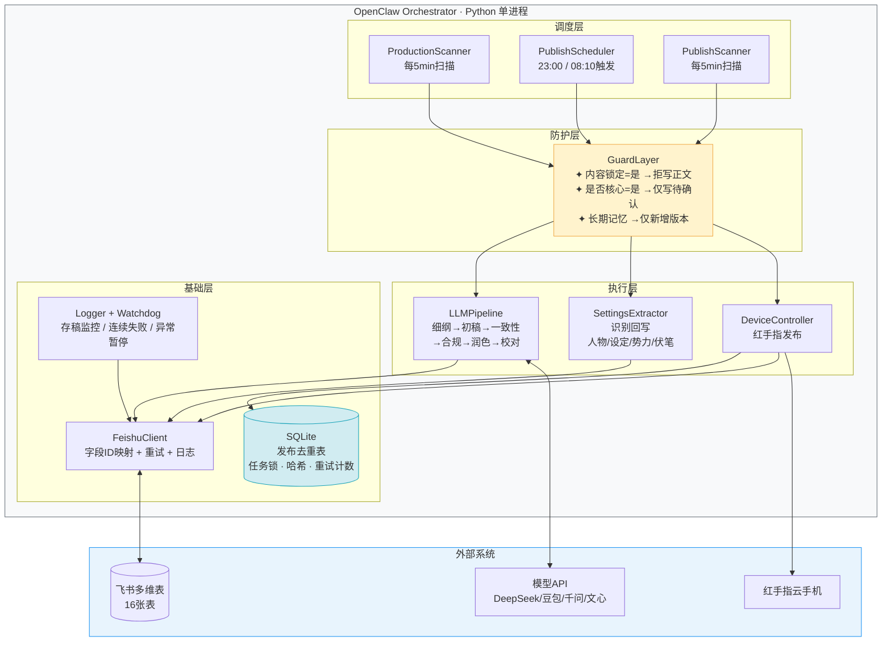
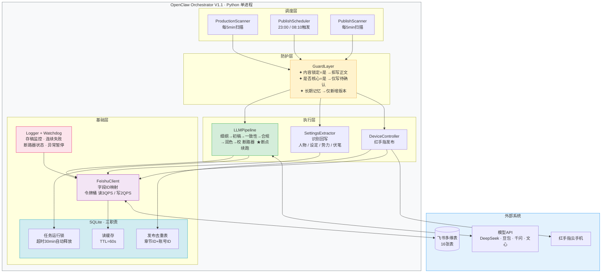
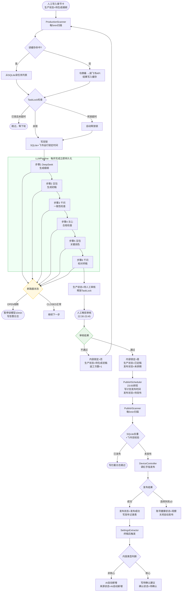
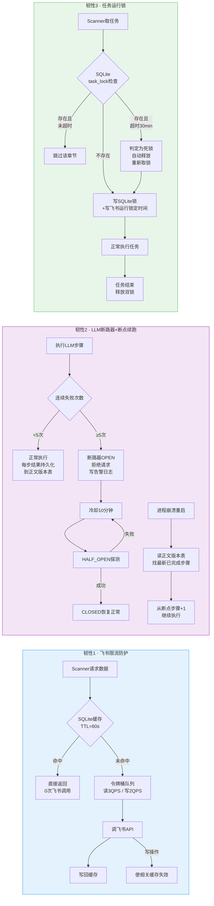

# OpenClaw（小龙虾）最简架构设计 V1.0

> 基于《OpenClaw 详细标准操作流程 SOP V1.1》设计
> 设计原则：最简实现、单体优先、飞书为权威数据源
> 输出日期：2026-05-20

---

## 一、关键假设

1. 飞书多维表（16 表）是**唯一权威数据源**，本系统不另建业务数据库，只用一个**本地 SQLite** 做去重锁与状态缓存。
2. 部署形态采用**单进程单体**（Python 服务），不引入消息队列、微服务、K8s。10 本并行通过线程池 / asyncio 并发即可。
3. 红手指云手机通过其官方 API / ADB 触发发布动作，不做"拟人化伪装"（与文档边界一致）。
4. 模型链：DeepSeek → 豆包 → 千问 → 文心 → 豆包 → 千问，固定串行；单本最多 2 章并发，全局最多 5 章并发。
5. 字段写权限与防覆盖**在代码层强制**（白名单 + 锁定校验），不依赖飞书原生权限。
6. 排班用单机定时器（APScheduler）即可，不上分布式调度。

---

## 二、架构图（单体 + 模块化）

```
┌──────────────────────────────────────────────────────┐
│              OpenClaw Orchestrator                   │
│              (Python 单进程服务)                      │
│                                                       │
│  ┌─────────────┐  ┌─────────────┐  ┌─────────────┐  │
│  │ Production  │  │ Publish     │  │ Publish     │  │
│  │ Scanner     │  │ Scheduler   │  │ Scanner     │  │
│  │ (5min cron) │  │ (23:00/8:10)│  │ (5min cron) │  │
│  └──────┬──────┘  └──────┬──────┘  └──────┬──────┘  │
│         │                │                │           │
│         ▼                ▼                ▼           │
│  ┌──────────────────────────────────────────────┐    │
│  │   Guard Layer（写权限白名单 + 防覆盖校验）    │    │
│  │   - 内容锁定=是 → 拒写正文/章节卡             │    │
│  │   - 是否核心=是 → 仅可写"待确认"建议           │    │
│  │   - 长期记忆 → 仅可新增版本                   │    │
│  └──────────────────────────────────────────────┘    │
│         │                │                │           │
│  ┌──────▼──────┐  ┌──────▼──────┐  ┌─────▼───────┐  │
│  │ LLM Pipeline│  │ Settings    │  │ Device      │  │
│  │ 细纲→初稿→  │  │ Extractor   │  │ Controller  │  │
│  │ 一致性→合规 │  │ (识别回写)  │  │ (红手指)    │  │
│  │ →润色→校对  │  │             │  │             │  │
│  └─────────────┘  └─────────────┘  └─────────────┘  │
│         │                │                │           │
│  ┌──────▼────────────────▼────────────────▼──────┐  │
│  │           Feishu Bitable Client               │  │
│  │   (字段ID映射 + 自动重试 + 全节点日志)         │  │
│  └───────────────────┬───────────────────────────┘  │
│                      │                                │
│  ┌───────────────────▼───────────────────────────┐  │
│  │   Local State: SQLite                         │  │
│  │   - 发布去重表（章节ID+账号ID+成功标记）       │  │
│  │   - 任务运行锁、上下文哈希、重试计数           │  │
│  └───────────────────────────────────────────────┘  │
└──────────────────────────────────────────────────────┘
        ▲                                  ▲
        │                                  │
   飞书多维表(16表)                  模型API + 红手指
   (权威数据源)                      (DeepSeek/豆包/千问/文心)
```

---

## 三、9 个核心模块（与 SOP 一一对应）

| # | 模块 | 职责 | 对应 SOP |
|---|---|---|---|
| 1 | `config.yaml` | 表ID/字段ID映射、模型Key、设备ID、扫描间隔、并发、存稿安全线、排班窗口 | §11 可配置参数 |
| 2 | `FeishuClient` | 16 表 CRUD，封装字段ID（不硬编码中文名） | §11 必须项 |
| 3 | `GuardLayer` | 字段级白名单 + 锁定/核心/长期记忆三类防覆盖规则 | §4 |
| 4 | `LLMPipeline` | 6 步串行 + 失败重试 3 次 + 写正文版本表/质量检查表 | §6 |
| 5 | `ProductionScanner` | 5min 扫描，按优先级取任务，推进到"待人工审核"停 | §6 |
| 6 | `PublishScheduler` | 晚 23:00 + 早 08:10 触发，按时间窗 + 6h 间隔 + 全局单发约束生成计划发布时间 | §7.2 |
| 7 | `PublishScanner` | 5min 扫描，SQLite 去重，调用红手指，写发布记录 | §7.1 |
| 8 | `SettingsExtractor` | 终稿后触发；按"非核心自动新增 / 核心待确认"规则回写人物/设定/势力/伏笔 | §8 |
| 9 | `Logger + Watchdog` | 每节点写运行日志表；监控存稿 / 连续失败 / API 超时 → 自动关开关 | §10 |

---

## 四、最简技术栈

| 类别 | 选型 | 理由 |
|---|---|---|
| 语言/运行时 | Python 3.11 | LLM SDK 生态完整、上手快 |
| 调度 | APScheduler | 支持 cron + interval，单进程足够 |
| HTTP | httpx + tenacity | async 并发 + 自动重试 |
| 本地状态 | SQLite | 单文件、零运维，一张去重表 + 一张任务锁表足够 |
| 配置 | YAML + .env | 字段映射用 YAML 单独维护，密钥放 .env |
| 日志 | loguru + 飞书运行日志表双写 | 本地排障 + 业务可见 |
| 部署 | 单台服务器（与红手指客户端同机或同内网）+ systemd / 任务计划自启 | 无需容器 |
| **不需要** | Redis、消息队列、Docker 编排、前端 | 当前规模（10 本）用不上 |

---

## 五、三条最关键的实现红线

1. **所有写入必经 GuardLayer**
   禁止任何模块直接调用 `FeishuClient.update`，必须走 `Guard.write(table, record_id, fields)`，由它判断锁定 / 核心 / 版本规则。

2. **字段 ID 映射文件单独维护**（`field_mapping.yaml`）
   代码里只引用语义名，避免飞书改名导致全线崩。

3. **发布去重在本地 SQLite + 飞书发布记录表双重校验**
   先查本地再查飞书，避免重复发布。

---

## 六、关键数据流（从章节卡到发布）

```
[人工导入章节卡]
  生产状态=待生成细纲
        │
        ▼
[ProductionScanner 每5min扫描]
        │
        ▼
[LLMPipeline 6步链路]  ──►  写 正文版本表 / 质量检查表 / 运行日志表
        │
        ▼
  生产状态=待人工审核  ←── 自动流程在此停止
        │
        ▼
[人工晚班审核 22:30-23:45]
        │
        ▼
  审核通过 → 内容锁定=是, 生产状态=已定稿, 发布状态=未排期
        │
        ▼
[PublishScheduler 23:00 排班]
        │
        ▼
  写入 计划发布时间 / 排班批次, 发布状态=待发布
        │
        ▼
[PublishScanner 每5min扫描] ──► SQLite去重 ──► DeviceController(红手指) ──► 写发布记录表
        │
        ▼
  发布状态=发布成功
        │
        ▼
[SettingsExtractor 终稿后触发]
        │
        ▼
  按"非核心自动新增 / 核心待确认"规则
  回写人物/设定/势力/伏笔（带"来源状态/是否核心/确认状态"）
```

---

## 七、防覆盖规则表（GuardLayer 核心）

| 对象 | 禁止写 | 允许写 |
|---|---|---|
| 内容锁定状态=是 的章节 | 章节名、章节卡核心、当前版本对应正文、人工审核意见 | 发布记录、数据反馈、运行日志、短期记忆、发布状态 |
| 人工创建 + 是否核心=是 的人物/设定/势力/伏笔 | 直接覆盖原内容 | 新建 "AI建议新增-待确认" 记录或备注 |
| 长期记忆旧版本 | 覆盖原文本 | 仅新建版本并切换"是否当前生效" |
| 已发布章节 | 修改已发布正文版本 | 追加数据反馈、运行日志 |
| 当前最终版正文 | 直接覆盖 | 新建更高版本，标记为最终版 |

---

## 八、可配置参数清单（config.yaml）

```yaml
scan:
  production_interval_seconds: 300       # 生产扫描间隔
  publish_interval_seconds: 300          # 发布扫描间隔

concurrency:
  per_novel_max: 2                       # 单本同时处理章数
  global_max: 5                          # 全局并发上限

retry:
  llm_max_attempts: 3                    # LLM 失败重试
  publish_max_attempts: 3                # 发布失败重试

inventory:
  safety_threshold: 6                    # 存稿安全线
  warning_threshold: 4                   # 存稿预警线
  pause_threshold: 3                     # 暂停发布阈值

publish_window:
  earliest: "08:30"
  latest:   "22:00"
  min_gap_hours: 6                       # 同本两章最小间隔
  jitter_minutes: [5, 15]                # 冲突顺延范围

confirm_queue:
  alert_threshold: 20                    # 待确认堆积报警
```

---

## 九、与 SOP §12 验收标准的映射

| SOP 验收项 | 本架构对应实现 |
|---|---|
| 10 本初始化 | FeishuClient 批量导入脚本 |
| 单章生产闭环 | ProductionScanner + LLMPipeline |
| 人工审核通过状态流转 | GuardLayer 状态机 |
| 排班逻辑 | PublishScheduler |
| 发布逻辑 | PublishScanner + DeviceController |
| 防重复发布 | SQLite 去重表 + 飞书双校验 |
| 设定回写 | SettingsExtractor |
| 核心设定保护 | GuardLayer 防覆盖规则 |
| 内容锁定保护 | GuardLayer 锁定校验 |
| 异常暂停 | Watchdog 自动关开关 |

---

## 十、后续可深入的细节

确认本架构方向后，可继续展开：

- **GuardLayer** 的字段白名单完整表（16 表 × 字段）
- **LLMPipeline** 的 6 步状态机与每步 Prompt 模板
- **SettingsExtractor** 的识别 Prompt 与 "自动新增 / 待确认" 判定逻辑
- **PublishScheduler** 排班算法伪代码
- 部署脚本与 systemd 单元文件









