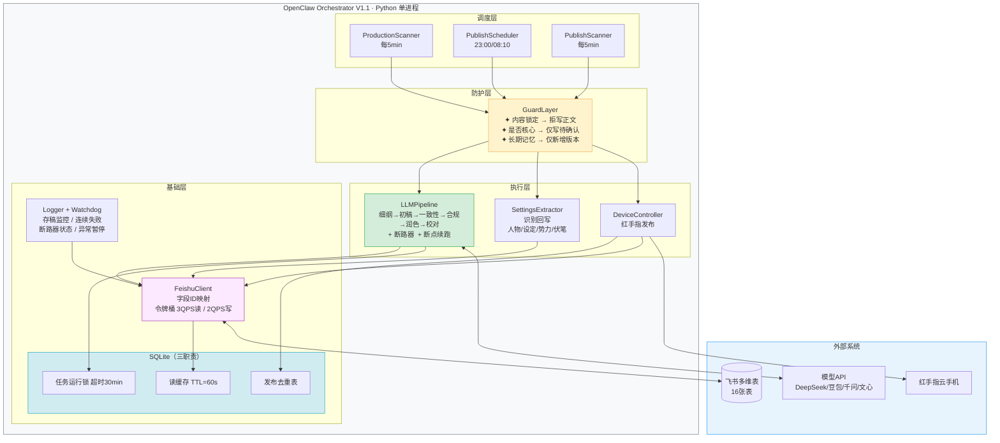

# OpenClaw（小龙虾）最简架构设计 V1.1

> 基于《OpenClaw 详细标准操作流程 SOP V1.1》设计
> 设计原则：最简实现、单体优先、飞书为权威数据源
> V1.0 → V1.1 变更：补强飞书限流、LLM 断点续跑、任务运行锁三处脆弱点
> 输出日期：2026-05-20

---

## 一、关键假设

1. 飞书多维表（16 表）是**唯一权威数据源**，本地 SQLite 承担读缓存、去重锁、任务运行锁三个职责。
2. 部署形态采用**单进程单体**（Python 服务），不引入消息队列、微服务、K8s。10 本并行通过 asyncio 并发即可。
3. 红手指云手机通过其官方 API / ADB 触发发布动作，不做"拟人化伪装"。
4. 模型链：DeepSeek → 豆包 → 千问 → 文心 → 豆包 → 千问，固定串行；单本最多 2 章并发，全局最多 5 章并发。
5. 字段写权限与防覆盖**在代码层强制**（白名单 + 锁定校验），不依赖飞书原生权限。
6. 排班用单机定时器（APScheduler），不上分布式调度。

---

## 二、架构图 V1.1（新增三层韧性机制）

```
┌─────────────────────────────────────────────────────────────┐
│                 OpenClaw Orchestrator V1.1                  │
│                  (Python 单进程服务)                         │
│                                                              │
│  ┌─────────────┐   ┌─────────────┐   ┌─────────────┐       │
│  │ Production  │   │ Publish     │   │ Publish     │       │
│  │ Scanner     │   │ Scheduler   │   │ Scanner     │       │
│  │ (5min cron) │   │ (23:00/8:10)│   │ (5min cron) │       │
│  └──────┬──────┘   └──────┬──────┘   └──────┬──────┘       │
│         │                 │                  │               │
│         ▼                 ▼                  ▼               │
│  ┌─────────────────────────────────────────────────┐        │
│  │   Guard Layer（写权限白名单 + 防覆盖校验）       │        │
│  │   - 内容锁定=是 → 拒写正文/章节卡               │        │
│  │   - 是否核心=是 → 仅可写"待确认"建议             │        │
│  │   - 长期记忆 → 仅可新增版本                     │        │
│  └─────────────────────────────────────────────────┘        │
│         │                 │                  │               │
│  ┌──────▼──────┐   ┌──────▼──────┐   ┌──────▼──────┐       │
│  │ LLM Pipeline│   │ Settings    │   │ Device      │       │
│  │ + 断路器    │   │ Extractor   │   │ Controller  │       │
│  │ + 断点续跑  │   │ (识别回写)  │   │ (红手指)    │       │
│  └─────────────┘   └─────────────┘   └─────────────┘       │
│         │                 │                  │               │
│  ┌──────▼─────────────────▼──────────────────▼──────┐       │
│  │              Feishu Bitable Client                │       │
│  │   字段ID映射 + 令牌桶限速(3QPS) + 自动重试         │       │  ← 新增令牌桶
│  └──────────────────────┬────────────────────────────┘       │
│                         │                                     │
│  ┌──────────────────────▼────────────────────────────┐       │
│  │                Local State: SQLite                │       │
│  │  ┌──────────────┐ ┌──────────────┐ ┌───────────┐ │       │
│  │  │ 读缓存层     │ │ 任务运行锁   │ │ 发布去重  │ │       │  ← 新增两层
│  │  │ TTL=60s      │ │ 锁+超时30min │ │ 章节+账号 │ │       │
│  │  └──────────────┘ └──────────────┘ └───────────┘ │       │
│  └───────────────────────────────────────────────────┘       │
└─────────────────────────────────────────────────────────────┘
        ▲                                    ▲
        │                                    │
   飞书多维表(16表)                   模型API + 红手指
   (权威数据源)              (DeepSeek / 豆包 / 千问 / 文心)
```

---

## 三、V1.1 新增的三层韧性机制

### 3.1 飞书读缓存 + 令牌桶（解决限流风险）

```
读请求路径：
  Scanner 请求数据
    → 先查 SQLite 读缓存（TTL 60s）
    → 命中 → 直接返回，不调飞书
    → 未命中 → 进令牌桶队列（3 QPS 上限）
              → 调飞书 API
              → 写回 SQLite 缓存

写请求路径：
  GuardLayer.write()
    → 令牌桶（3 QPS 上限）
    → 调飞书 API
    → 成功后同步使 SQLite 该记录缓存失效
```

**令牌桶参数：**
- 飞书读：3 QPS，桶容量 10
- 飞书写：2 QPS，桶容量 5
- LLM 调用：各模型独立令牌桶，初始均 2 QPS

---

### 3.2 LLM 断路器 + 断点续跑（解决链路稳定性）

**断路器规则（每个模型独立）：**

```
状态机：CLOSED → OPEN → HALF_OPEN → CLOSED

CLOSED（正常）:
  - 连续失败 5 次 → 切换到 OPEN，写告警日志

OPEN（熔断）:
  - 冷却 10 分钟，拒绝所有该模型请求
  - 10 分钟后 → 切换到 HALF_OPEN

HALF_OPEN（探测）:
  - 放行 1 次请求
  - 成功 → 切换到 CLOSED
  - 失败 → 重新切换到 OPEN（再等 10 分钟）
```

**断点续跑规则：**

LLM Pipeline 每完成一步立即写入飞书正文版本表：

```
版本类型字段值：
  细纲稿   → 步骤1完成，持久化
  初稿     → 步骤2完成，持久化
  一致性稿 → 步骤3完成，持久化
  合规稿   → 步骤4完成，持久化
  润色稿   → 步骤5完成，持久化
  校对稿   → 步骤6完成 = 终稿

Scanner 重新捡起任务时：
  → 读正文版本表，找最新已完成版本
  → 从该版本对应的下一步骤继续
  → 不重跑已完成步骤
```

---

### 3.3 任务运行锁（解决进程崩溃后重复生产）

**锁结构（SQLite task_lock 表）：**

```sql
CREATE TABLE task_lock (
    chapter_id   TEXT PRIMARY KEY,
    locked_at    TIMESTAMP,
    lock_step    TEXT,    -- 当前执行到的步骤名
    process_pid  INTEGER
);
```

**飞书侧同步：** 章节任务表新增 `运行锁定时间` 字段（时间戳）

**加锁/释放逻辑：**

```
Scanner 取任务前：
  1. 查 SQLite task_lock，若存在且 locked_at < now-30min → 视为死锁，自动释放
  2. 若不存在 → 写入 SQLite + 更新飞书 运行锁定时间
  3. 锁存在且未超时 → 跳过该章节

任务完成/失败后：
  → 删除 SQLite task_lock 记录
  → 清空飞书 运行锁定时间 字段
```

---

## 四、11 个核心模块（V1.1 版）

| # | 模块 | 职责 | 对应 SOP / 新增 |
|---|---|---|---|
| 1 | `config.yaml` | 表ID/字段ID映射、模型Key、设备ID、扫描间隔、并发、存稿安全线、排班窗口、令牌桶参数 | §11 |
| 2 | `FeishuClient` | 16 表 CRUD，封装字段ID，内置令牌桶限速 | §11 |
| 3 | `ReadCache` | SQLite 读缓存，TTL=60s，写入时自动失效 | **V1.1新增** |
| 4 | `GuardLayer` | 字段级白名单 + 锁定/核心/长期记忆三类防覆盖规则 | §4 |
| 5 | `LLMPipeline` | 6 步串行 + 各模型断路器 + 断点续跑（步骤持久化） | §6 + **V1.1强化** |
| 6 | `TaskLock` | SQLite task_lock + 飞书运行锁定时间字段双锁，防重复生产 | **V1.1新增** |
| 7 | `ProductionScanner` | 5min 扫描，先检 TaskLock，按优先级取任务，推进到"待人工审核"停 | §6 |
| 8 | `PublishScheduler` | 晚 23:00 + 早 08:10 触发，生成计划发布时间 | §7.2 |
| 9 | `PublishScanner` | 5min 扫描，SQLite 去重，调红手指，写发布记录 | §7.1 |
| 10 | `SettingsExtractor` | 终稿后触发，识别回写人物/设定/势力/伏笔 | §8 |
| 11 | `Logger + Watchdog` | 每节点写运行日志表；监控存稿/连续失败/API超时/断路器状态 | §10 |

---

## 五、最简技术栈

| 类别 | 选型 | 理由 |
|---|---|---|
| 语言/运行时 | Python 3.11 | LLM SDK 生态完整 |
| 调度 | APScheduler | cron + interval，单进程足够 |
| HTTP | httpx + tenacity | async 并发 + 自动重试 |
| 本地状态 | SQLite | 读缓存 + 任务锁 + 去重，单文件零运维 |
| 限流 | pyrate_limiter | 轻量令牌桶，支持多桶独立配置 |
| 配置 | YAML + .env | 字段映射 YAML 单独维护，密钥放 .env |
| 日志 | loguru + 飞书运行日志表双写 | 本地排障 + 业务可见 |
| 部署 | 单台服务器 + systemd 自启 | 无需容器 |
| **不需要** | Redis、消息队列、Docker 编排、前端 | 当前规模用不上 |

---

## 六、三条实现红线（不变）

1. **所有写入必经 GuardLayer** — 禁止任何模块直接调 `FeishuClient.update`
2. **字段 ID 映射单独维护**（`field_mapping.yaml`）— 代码只引用语义名
3. **发布去重本地 SQLite + 飞书双校验** — 先查本地再查飞书

---

## 七、关键数据流 V1.1

```
[人工导入章节卡]
  生产状态=待生成细纲
        │
        ▼
[ProductionScanner 每5min]
  → 查 ReadCache（TTL 60s）获取任务列表
  → TaskLock 检查：已锁且未超时 → 跳过
  → 未锁 → 写双锁（SQLite + 飞书运行锁定时间）
        │
        ▼
[LLMPipeline 6步，每步完成立即持久化]
  细纲 → 初稿 → 一致性 → 合规 → 润色 → 校对
  ↑ 任一步骤断路器 OPEN → 暂停该模型10分钟，写告警
  ↑ 进程崩溃重启 → 读最新版本类型，从断点续跑
        │
        ▼
  生产状态=待人工审核 → 释放 TaskLock
        │
        ▼
[人工晚班审核 22:30-23:45]
        │
        ▼
  审核通过 → 内容锁定=是, 生产状态=已定稿, 发布状态=未排期
        │
        ▼
[PublishScheduler 23:00 排班]
  写入 计划发布时间 / 排班批次, 发布状态=待发布
        │
        ▼
[PublishScanner 每5min]
  → SQLite 去重 + 飞书发布记录双校验
  → DeviceController(红手指) 发布
  → 写发布记录表
        │
        ▼
  发布状态=发布成功
        │
        ▼
[SettingsExtractor 终稿后触发]
  非核心 → AI自动新增（来源状态=AI自动新增）
  核心   → 仅写待确认建议（确认状态=待确认）
```

---

## 八、防覆盖规则表（GuardLayer，不变）

| 对象 | 禁止写 | 允许写 |
|---|---|---|
| 内容锁定状态=是 的章节 | 章节名、章节卡核心、当前版本正文、人工审核意见 | 发布记录、数据反馈、运行日志、短期记忆、发布状态 |
| 人工创建 + 是否核心=是 | 直接覆盖原内容 | 新建"AI建议新增-待确认"记录或备注 |
| 长期记忆旧版本 | 覆盖原文本 | 仅新建版本并切换"是否当前生效" |
| 已发布章节 | 修改已发布正文版本 | 追加数据反馈、运行日志 |
| 当前最终版正文 | 直接覆盖 | 新建更高版本标记为最终版 |

---

## 九、可配置参数清单（config.yaml V1.1）

```yaml
scan:
  production_interval_seconds: 300
  publish_interval_seconds: 300

concurrency:
  per_novel_max: 2
  global_max: 5

retry:
  llm_max_attempts: 3
  publish_max_attempts: 3

circuit_breaker:                         # V1.1新增
  failure_threshold: 5                   # 触发断路的连续失败次数
  cooldown_seconds: 600                  # 熔断冷却时间（10分钟）

rate_limit:                              # V1.1新增
  feishu_read_qps: 3
  feishu_write_qps: 2
  feishu_bucket_capacity: 10

cache:                                   # V1.1新增
  read_cache_ttl_seconds: 60

task_lock:                               # V1.1新增
  lock_timeout_minutes: 30               # 超时视为死锁自动释放

inventory:
  safety_threshold: 6
  warning_threshold: 4
  pause_threshold: 3

publish_window:
  earliest: "08:30"
  latest:   "22:00"
  min_gap_hours: 6
  jitter_minutes: [5, 15]

confirm_queue:
  alert_threshold: 20
```

---

## 十、与 SOP §12 验收标准的映射（V1.1）

| SOP 验收项 | 本架构对应实现 |
|---|---|
| 10 本初始化 | FeishuClient 批量导入脚本 |
| 单章生产闭环 | ProductionScanner + LLMPipeline（断点续跑） |
| 人工审核通过状态流转 | GuardLayer 状态机 |
| 排班逻辑 | PublishScheduler |
| 发布逻辑 | PublishScanner + DeviceController |
| 防重复发布 | SQLite 去重表 + 飞书双校验 |
| 设定回写 | SettingsExtractor |
| 核心设定保护 | GuardLayer 防覆盖规则 |
| 内容锁定保护 | GuardLayer 锁定校验 |
| 异常暂停 | Watchdog 自动关开关 + 断路器 |
| **飞书限流保护（新）** | ReadCache + 令牌桶 |
| **LLM 中断恢复（新）** | 步骤持久化 + 断点续跑 |
| **重复生产保护（新）** | TaskLock 双锁机制 |

---

## 十一、Mermaid 可视化图（粘贴到 mermaid.live 预览）



---

## 十二、稳定性重评估（V1.1）

| 维度 | V1.0 | V1.1 | 提升点 |
|---|---|---|---|
| 飞书限流抗性 | 6/10 | 9/10 | 读缓存 + 令牌桶消除大部分限流风险 |
| LLM 链路稳定性 | 6/10 | 8/10 | 断路器防雪崩，断点续跑减少浪费 |
| 崩溃恢复能力 | 6/10 | 9/10 | 双锁 + 步骤持久化，重启后无缝续跑 |
| 发布链路稳定性 | 8/10 | 8/10 | 无变化，原本已足够 |
| 架构设计合理性 | 9/10 | 9/10 | 保持最简，未引入额外中间件 |
| **综合** | **7/10** | **8.5/10** | 预计故障从每周半天降至每月以下 |
